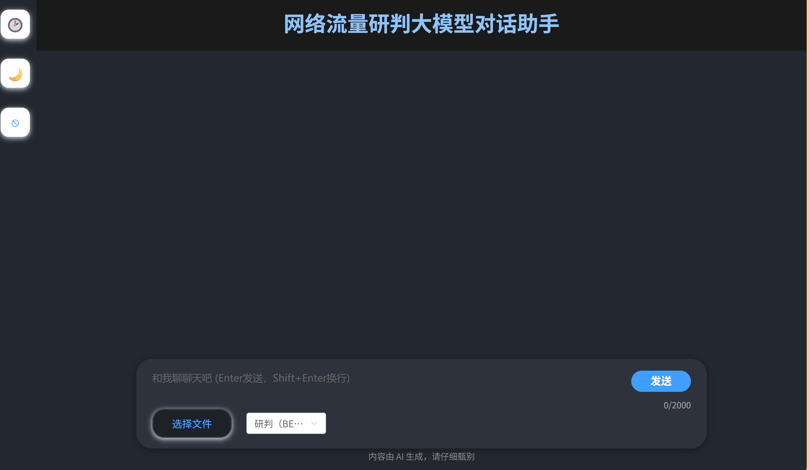
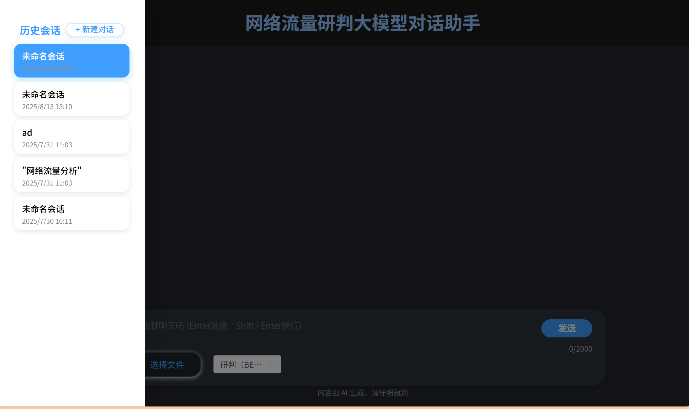

# NetworkTraffic 网络流量分析系统部署说明文档

## 📋 目录
- [系统概述](#系统概述)
- [镜像说明](#镜像说明)
- [环境准备](#环境准备)
- [镜像导入](#镜像导入)
- [服务启动](#服务启动)
- [服务检查](#服务检查)
- [前端页面介绍](#前端页面介绍)
- [故障排除](#故障排除)
- [常用命令](#常用命令)

## 🎯 系统概述

NetworkTraffic 是一个基于大模型的网络流量研判分析系统，包含：
- **前端**: Vue.js + Element UI 构建的用户界面
- **后端**: Django + Python 构建的API服务
- **数据库**: MySQL 8.0 数据存储
- **AI模型**: 集成大语言模型进行流量分析

## 🐳 镜像说明

### 核心镜像列表

| 镜像名称 | 版本 | 大小 | 说明 |
|---------|------|------|------|
| `networktraffic-frontend` | latest | 113MB | Vue.js前端应用，包含Nginx服务器 |
| `networktraffic-backend` | latest | 1.07GB | Django后端API服务 |
| `mysql` | 8.0 | 1.63GB | MySQL数据库服务 |

### 镜像功能说明

#### 1. Frontend 镜像 (`networktraffic-frontend:latest`)
- **技术栈**: Vue.js 3 + Element UI + Vite
- **服务器**: 内置Nginx，端口80
- **功能**: 用户界面、流量分析、AI对话
- **特点**: 响应式设计，支持明暗主题切换

#### 2. Backend 镜像 (`networktraffic-backend:latest`)
- **技术栈**: Django + Python + Gunicorn
- **服务器**: Gunicorn WSGI，端口8000
- **功能**: API接口、数据处理、AI模型集成
- **特点**: 支持健康检查、自动重启

#### 3. MySQL 镜像 (`mysql:8.0`)
- **数据库**: MySQL 8.0
- **端口**: 3306 (容器内) / 3307 (宿主机)
- **功能**: 用户数据、会话记录、分析结果存储
- **特点**: 数据持久化、健康检查

## 🔧 环境准备

### 系统要求
- **操作系统**: Windows 10/11, Linux, macOS
- **Docker**: 20.10+
- **Docker Compose**: 2.0+
- **内存**: 最少4GB，推荐8GB+
- **存储**: 最少10GB可用空间

### 配置文件修改
在部署前，需要修改以下关键配置文件：

#### 1. API配置文件 (`HTTP/modeltask/api_config.py`)
- **用途**: 配置AI模型的API接口参数
- **需要修改的内容**:
  - API密钥配置
  - 模型端点URL
  - 请求超时设置
  - 模型参数配置

#### 2. 临时路径配置文件 (`HTTP/modeltask/temp_path.py`)
- **用途**: 配置系统临时文件存储路径
- **需要修改的内容**:
  - 临时文件目录路径
  - 文件上传路径
  - 日志文件路径
  - 缓存目录设置

> **重要提示**: 这些配置文件包含敏感信息和路径配置，请根据实际部署环境进行相应修改。

### 安装Docker
```bash
# Windows (使用Docker Desktop)
# 下载并安装 Docker Desktop for Windows

# Linux (Ubuntu/Debian)
curl -fsSL https://get.docker.com -o get-docker.sh
sudo sh get-docker.sh

# macOS
brew install --cask docker
```

## 📥 镜像导入

### 导入命令

#### 方法1: 使用docker load命令
```bash
# 导入前端镜像
docker load -i networktraffic-frontend.tar

# 导入后端镜像
docker load -i networktraffic-backend.tar

# 导入MySQL镜像 (可选，Docker会自动下载)
docker pull mysql:8.0
```

#### 方法2: 使用docker import命令
```bash
# 如果有tar.gz格式的镜像
gunzip -c networktraffic-frontend.tar.gz | docker load
```

### 验证镜像导入
```bash
# 查看所有镜像
docker images

# 查看特定镜像
docker images networktraffic-frontend
docker images networktraffic-backend
docker images mysql
```

## 🚀 服务启动

### 方法1: 使用Docker Compose (推荐)

#### 1. 准备环境变量和配置文件
```bash
# 复制环境变量模板
cp env.example .env

# 编辑环境变量 (可选)
notepad .env

# 检查并修改API配置文件
notepad HTTP/modeltask/api_config.py

# 检查并修改临时路径配置
notepad HTTP/modeltask/temp_path.py
```

#### 2. 启动所有服务
```bash
# 启动所有服务 (后台运行)
docker-compose -f docker-compose.production.yml up -d

# 启动并查看日志
docker-compose -f docker-compose.production.yml up
```

#### 3. 停止服务
```bash
# 停止所有服务
docker-compose -f docker-compose.production.yml down

# 停止并删除数据卷
docker-compose -f docker-compose.production.yml down -v
```

### 方法2: 手动启动容器

#### 1. 创建网络
```bash
docker network create network_traffic_network
```

#### 2. 启动MySQL
```bash
docker run -d \
  --name network_traffic_mysql \
  --network network_traffic_network \
  -e MYSQL_ROOT_PASSWORD=123456 \
  -e MYSQL_DATABASE=NetworkTraffic \
  -p 3307:3306 \
  -v mysql_data:/var/lib/mysql \
  mysql:8.0
```

#### 3. 启动后端
```bash
docker run -d \
  --name network_traffic_backend \
  --network network_traffic_network \
  -p 8000:8000 \
  -v ${PWD}/HTTP:/app \
  -v ${PWD}/logs:/app/logs \
  networktraffic-backend:latest
```

#### 4. 启动前端
```bash
docker run -d \
  --name network_traffic_frontend \
  --network network_traffic_network \
  -p 23456:80 \
  networktraffic-frontend:latest
```

## 🔍 服务检查

### 查看服务状态

#### 1. 使用Docker Compose
```bash
# 查看所有服务状态
docker-compose -f docker-compose.production.yml ps

# 查看服务日志
docker-compose -f docker-compose.production.yml logs

# 查看特定服务日志
docker-compose -f docker-compose.production.yml logs backend
docker-compose -f docker-compose.production.yml logs frontend
docker-compose -f docker-compose.production.yml logs mysql
```

#### 2. 使用Docker命令
```bash
# 查看运行中的容器
docker ps

# 查看所有容器 (包括停止的)
docker ps -a

# 查看容器日志
docker logs network_traffic_mysql
docker logs network_traffic_backend
docker logs network_traffic_frontend

# 查看容器详细信息
docker inspect network_traffic_frontend
```

### 健康检查
```bash
# 检查MySQL连接
docker exec network_traffic_mysql mysqladmin ping -h localhost

# 检查后端API
curl http://localhost:8000/api/health/

# 检查前端页面
curl http://localhost:23456/
```

### 端口检查
```bash
# 检查端口占用
netstat -an | findstr "8000"
netstat -an | findstr "23456"
netstat -an | findstr "3307"

# 或使用PowerShell
Get-NetTCPConnection -LocalPort 8000,23456,3307
```

## 🌐 前端页面介绍

### 1. 登录页面 (`/login`)
- **功能**: 用户身份验证
- **特性**: 
  - 用户名/密码登录
  - 表单验证
  - 错误提示
  - 响应式设计
- **访问**: http://localhost:23456/login


*登录页面 - 简洁的用户认证界面，支持用户名密码登录*

### 2. 注册页面 (`/register`)
- **功能**: 新用户注册
- **特性**:
  - 用户名/密码注册
  - 密码强度验证
  - 注册成功提示
  - 自动跳转登录
- **访问**: http://localhost:23456/register


*注册页面 - 新用户注册界面，包含用户名和密码字段*

### 3. 主页面 (`/`)
- **功能**: 网络流量分析主界面
- **特性**:
  - AI对话助手
  - 流量分析工具
  - 历史会话管理
  - 文件上传/下载
  - 明暗主题切换
  - 响应式布局

#### 主要功能模块

##### 3.1 欢迎界面
- 系统介绍
- 快速开始指南
- 登录提示


*欢迎界面 - 系统介绍和快速开始指南，包含登录提示*

##### 3.2 对话界面
- AI助手对话
- 消息历史
- 文件附件支持
- 会话管理


*对话界面 - AI助手对话界面，支持消息历史和文件附件*

##### 3.3 侧边栏功能
- 历史会话列表
- 主题切换
- 用户登录状态
- 新建对话


*侧边栏功能 - 历史会话列表、主题切换和用户状态管理*

##### 3.4 流量分析功能
- 网络流量数据上传
- AI智能分析
- 规则提取
- PCAP文件生成


*历史消息界面 - 显示历史对话记录和会话管理功能*

### 4. 界面特色功能

#### 4.1 主题切换
- 支持明暗主题切换
- 自动保存用户偏好
- 响应式设计适配

#### 4.2 文件管理
- 支持多种文件格式上传
- 文件预览和下载
- 安全的文件存储

#### 4.3 智能分析
- 集成大语言模型
- 支持多种分析模式：
  - 研判 (BERT)
  - 规则提取
  - 生成PCAP文件

## 🛠️ 故障排除

### 常见问题及解决方案

#### 1. 容器启动失败
```bash
# 查看详细错误信息
docker logs <container_name>

# 检查端口冲突
netstat -an | findstr "<port>"

# 检查磁盘空间
df -h
```

#### 2. 数据库连接失败
```bash
# 检查MySQL容器状态
docker ps | grep mysql

# 检查数据库日志
docker logs network_traffic_mysql

# 测试数据库连接
docker exec -it network_traffic_mysql mysql -u root -p
```

#### 3. 前端无法访问
```bash
# 检查前端容器状态
docker ps | grep frontend

# 检查Nginx配置
docker exec -it network_traffic_frontend nginx -t

# 检查端口映射
docker port network_traffic_frontend
```

#### 4. 后端API无响应
```bash
# 检查后端容器状态
docker ps | grep backend

# 检查Django日志
docker logs network_traffic_backend

# 测试API端点
curl http://localhost:8000/api/health/
```

#### 5. 配置文件相关问题
```bash
# 检查API配置文件
cat HTTP/modeltask/api_config.py

# 检查临时路径配置
cat HTTP/modeltask/temp_path.py

# 检查配置文件权限
ls -la HTTP/modeltask/api_config.py
ls -la HTTP/modeltask/temp_path.py
```

**常见配置文件问题**:
- API密钥未正确配置
- 临时路径不存在或无权限
- 模型端点URL无法访问
- 文件路径配置错误

### 日志分析
```bash
# 实时查看日志
docker-compose -f docker-compose.production.yml logs -f

# 查看特定时间段的日志
docker-compose -f docker-compose.production.yml logs --since="2024-01-01T00:00:00"

# 查看错误日志
docker-compose -f docker-compose.production.yml logs | grep -i error
```

## 📚 常用命令

### Docker 基础命令
```bash
# 镜像管理
docker images                    # 查看所有镜像
docker rmi <image_id>           # 删除镜像
docker save <image> > file.tar  # 导出镜像
docker load < file.tar          # 导入镜像

# 容器管理
docker ps                       # 查看运行中的容器
docker ps -a                    # 查看所有容器
docker stop <container_id>      # 停止容器
docker start <container_id>     # 启动容器
docker restart <container_id>   # 重启容器
docker rm <container_id>        # 删除容器

# 日志和调试
docker logs <container_id>      # 查看容器日志
docker exec -it <container_id> bash  # 进入容器
docker inspect <container_id>   # 查看容器详细信息
```

### Docker Compose 命令
```bash
# 服务管理
docker-compose up -d            # 启动服务
docker-compose down             # 停止服务
docker-compose restart          # 重启服务
docker-compose ps               # 查看服务状态

# 日志管理
docker-compose logs             # 查看所有服务日志
docker-compose logs -f          # 实时查看日志
docker-compose logs <service>   # 查看特定服务日志

# 服务操作
docker-compose exec <service> bash  # 进入服务容器
docker-compose pull              # 拉取最新镜像
docker-compose build            # 重新构建服务
```

### 系统监控命令
```bash
# 资源使用情况
docker stats                     # 查看容器资源使用
docker system df                # 查看Docker系统使用情况

# 网络检查
docker network ls               # 查看网络列表
docker network inspect <network> # 查看网络详情

# 数据卷管理
docker volume ls                # 查看数据卷
docker volume inspect <volume>  # 查看数据卷详情
```

## 📞 技术支持

### 获取帮助
- 查看项目README.md文件
- 检查日志文件获取错误信息
- 使用Docker官方文档作为参考

### 联系信息
- 项目仓库: [NetworkTraffic Repository]
- 问题反馈: [Issues Page]
- 技术文档: [Documentation]

---

**注意**: 本文档基于当前版本编写，如有更新请参考最新版本。在生产环境部署前，请确保已充分测试所有功能。
